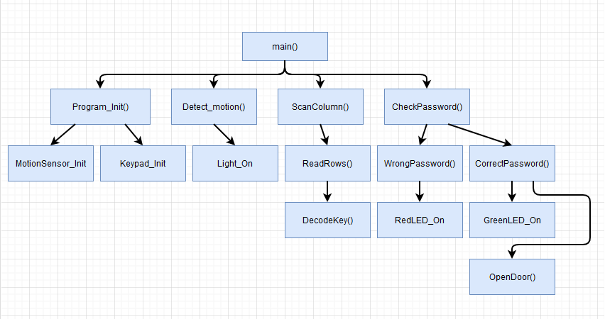

# SmartHus

### Projekt beskrivelse
Jeg Har tænkt mig at lave et smart hus, hvor der er en sensor udenfor som hvis den fanger noget bevægelse tænder den noget lys ved indgangen af huset. for at komme ind i huset skal du trykke en kode ind på en lille keypad og hvis koden er rigtig vil døren åbne. indenfor vil der være en sensor som skal holde styr på om der er nogle inde i huset og så længe der er nogle indenfor skal der køre en mølle som skal lave luft cirkulation.

### HIPO diagram

### Sådan sætter du det op på en elegoo mega2560
PORTK 1, 2, 3, 4, 5, 6 og 7 er til keypad.
De tilhøre pin A7, A8, A9, A10, A11, A12, A13, A14 og A15.

PORTB 7 skal føre til en 330 omh modstand som går videre til en led som skal er dit lys.
PORTB 7 er Pin 13 på boarded.

PORTB 6 skal gå hen til det midderste ben på din HC--SR501 Body Sensor Module.
PORTB 6 er Pin 12.

PORTB 5 skal føre til den orange ledning på servo moteren
PORTB 5 er Pin 11.

PORTH 4 skal føre til en 330 omh modstand som går videre til en rød LED som lyser hvis du skriver koden forkert.
PORTH 4 er Pin 7

PORTH 5 skal føre til en 330 omh modstand som går videre til en Grøn LED som lyser hvis du skriver koden rigtig.
PORTH 5 er Pin 8